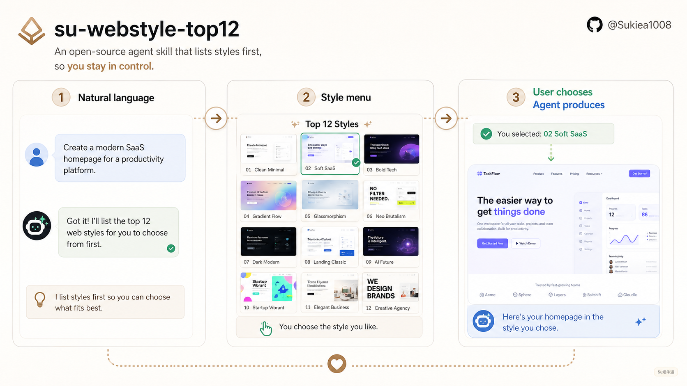
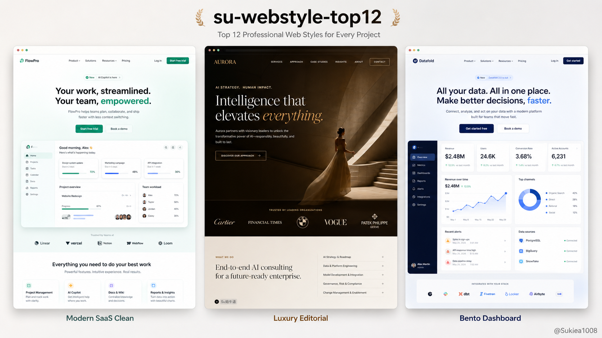

# su-webstyle-top12

**中文** | [English](#english)

海外网页风格 Top 12 图谱 Skill，适用于 Codex、Claude Code 和其他 Agent 编程工具。

它不是一个替用户拍板的模板包，而是一个开放风格图谱：**Agent 先列出风格，用户自己选择，然后再落地产出。**


## 它能做什么

`su-webstyle-top12` 可以帮助 Agent：

- 列出 12 种海外主流网页设计风格
- 用简单语言解释每种风格的区别
- 生成可视化风格看板，方便用户自选
- 在用户选定风格后，生成完整首页或 landing page
- 通过 Markdown 指令适配 Codex、Claude Code 和其他 Agent

默认原则：

> 先列风格，让用户选，再开始产出。


## Top 12 风格

| # | 风格 | 适合场景 | 气质 |
|---|---|---|---|
| 01 | Modern SaaS Clean / 现代 SaaS 简洁风 | SaaS、AI 工具、B2B | 干净、柔和、专业 |
| 02 | Editorial Tech / 编辑型科技风 | AI 实验室、研究机构、高端服务 | 聪明、杂志感、内容感 |
| 03 | Linear / Vercel Dark / 开发者暗黑风 | API、基础设施、开发者工具 | 技术、克制、锋利 |
| 04 | Stripe-ish Business / Stripe 式商业风 | 金融科技、平台、商业工具 | 国际化、商业、彩色 |
| 05 | Notion / Figma Friendly / 友好生产力风 | 协作、创作者、教育 | 亲和、聪明、轻办公 |
| 06 | Apple Premium Minimal / Apple 式极简高级风 | 硬件、旗舰产品、高端软件 | 高级、精准、克制 |
| 07 | Swiss International / 瑞士国际主义风 | 设计机构、文化项目、作品集 | 理性、网格、设计感 |
| 08 | Bento Grid / Bento 模块风 | 多功能 SaaS、AI 产品 | 模块化、好扫读 |
| 09 | Neo Brutalism / 新粗野主义风 | 活动、年轻品牌、实验项目 | 大胆、抓眼、有态度 |
| 10 | Luxury Editorial / 奢华编辑风 | 高端品牌、咨询、艺术 | 克制、精致、有质感 |
| 11 | Data Dashboard / 数据仪表盘风 | 数据分析、运营后台、投研工具 | 实用、高密度、可信 |
| 12 | Playful Startup / 活泼创业风 | 教育、社区、消费产品 | 明亮、年轻、表达性强 |

## 直接产出示例

用户选定风格后，这个 skill 可以把风格落到完整首页方向。下面示例包含 Modern SaaS Clean、Luxury Editorial 和 Bento Dashboard。

网页样例里的 UI 文案默认保持英文，以维持海外网页调性；中文内容主要用于 README、教程、风格解释和外层宣传图。


## 安装

### Codex

复制到 Codex skills 目录：

```bash
cp -R su-webstyle-top12 ~/.codex/skills/
```

自然语言使用：

```text
列出海外主流网页风格，我想自己选。
```

或者：

```text
用 su-webstyle-top12，给我一个网页风格看板。
```

### Claude Code

复制到 Claude skills 目录：

```bash
cp -R su-webstyle-top12 ~/.claude/skills/
```

显式调用：

```text
/su-webstyle-top12 show me the web style atlas
```

当你的请求明显是在要海外网页风格、landing page 视觉方向或风格看板时，Claude Code 也可能自动使用它。

### 通用 Agent

可以使用：

- `SKILL.md`：Agent Skills 兼容工具
- `AGENTS.md`：通用 coding agent
- `CLAUDE.md`：Claude Code 项目
- `adapters/cursor-rule.md`：Cursor / IDE Agent 规则

## 用法示例

浏览风格：

```text
列出海外主流网页风格。
```

生成看板后自选：

```text
给我一个 Top 12 网页风格看板，我自己选。
```

需要 Agent 辅助 shortlist 时：

```text
我做的是 AI 数据分析产品，你帮我 shortlist 3 个适合的海外网页风格。
```

选定后直接产出：

```text
用 10 Luxury Editorial 做一个完整首页，品牌是一个高端 AI 顾问工作室。
```

## 中文设计说明

这个 skill 面向中文用户友好，但网页样例中的 UI 文案默认可以保持英文，以维持海外网页调性。中文内容适合用于说明、README、教程、风格解释和外层宣传图。

本仓库不包含字体文件。实际生成网页或视觉稿时，请根据项目环境自行配置可用字体。

## 项目结构

```text
su-webstyle-top12/
├── SKILL.md
├── AGENTS.md
├── CLAUDE.md
├── README.md
├── references/
│   ├── style-atlas.md
│   ├── usage-modes.md
│   └── output-patterns.md
├── assets/
│   ├── style-board-template.html
│   ├── promo-01-style-atlas.png
│   ├── promo-02-how-it-works.png
│   ├── promo-03-output-examples.png
│   ├── promo-en-01-style-atlas.png
│   ├── promo-en-02-how-it-works.png
│   └── promo-en-03-output-examples.png
├── examples/
│   └── prompts.md
└── adapters/
    └── cursor-rule.md
```

## Creator Mark

本仓库公开宣传图包含小号署名：

```text
@Sukiea1008
```

Skill 不会在普通用户产出里自动添加这个署名，除非用户明确要求。

## License

MIT

---

<a id="english"></a>

# su-webstyle-top12

[中文](#su-webstyle-top12) | **English**

Top 12 overseas web style atlas for Codex, Claude Code, and other agentic coding tools.

This is not a template pack that forces a design decision. It is an open style atlas: **the agent lists clear style directions first, the user chooses, and then the agent produces.**


## What It Does

`su-webstyle-top12` helps an agent:

- show 12 mainstream overseas web design styles
- explain the difference between styles in plain language
- generate a visual style board for self-selection
- apply a selected style to a complete homepage or landing page
- support Codex, Claude Code, and other agents through portable Markdown instructions

Default workflow:

> list styles first, let the user choose, then produce.



## Top 12 Styles

| # | Style | Best for | Feel |
|---|---|---|---|
| 01 | Modern SaaS Clean | SaaS, AI tools, B2B | clean, soft, professional |
| 02 | Editorial Tech | AI labs, research, premium services | intelligent, magazine-like |
| 03 | Linear / Vercel Dark | APIs, infra, developer tools | technical, sharp, calm |
| 04 | Stripe-ish Business | fintech, platforms, commerce | colorful, commercial |
| 05 | Notion / Figma Friendly | productivity, creators, education | approachable, smart |
| 06 | Apple Premium Minimal | hardware, flagship products | premium, precise |
| 07 | Swiss International | studios, culture, portfolios | rational, design-literate |
| 08 | Bento Grid | multi-feature SaaS, AI tools | modular, scannable |
| 09 | Neo Brutalism | campaigns, youth brands | bold, loud |
| 10 | Luxury Editorial | premium brands, consulting, art | refined, tactile |
| 11 | Data Dashboard | analytics, ops, research tools | practical, dense |
| 12 | Playful Startup | education, community, consumer | bright, expressive |

## Example Outputs

After the user chooses a style, the skill can apply it to complete homepage directions. These examples include Modern SaaS Clean, Luxury Editorial, and Bento Dashboard.



## Install

### Codex

Copy this folder into your Codex skills directory:

```bash
cp -R su-webstyle-top12 ~/.codex/skills/
```

Then prompt naturally:

```text
Show me the Top 12 overseas web styles so I can choose one.
```

or:

```text
Use su-webstyle-top12 to create a web style board.
```

### Claude Code

Copy this folder into your Claude skills directory:

```bash
cp -R su-webstyle-top12 ~/.claude/skills/
```

Invoke directly:

```text
/su-webstyle-top12 show me the web style atlas
```

Claude Code may also auto-use it when your request clearly asks for overseas web style options or a landing page visual direction.

### Generic Agents

Use:

- `SKILL.md` for Agent Skills-compatible tools
- `AGENTS.md` for generic coding agents
- `CLAUDE.md` for Claude Code projects
- `adapters/cursor-rule.md` for Cursor-style rules

## Usage Patterns

Browse styles:

```text
Show me the Top 12 overseas web styles.
```

Self-select from a board:

```text
Create a Top 12 web style board and let me choose.
```

Ask for a shortlist only when wanted:

```text
I am building an AI data analytics product. Shortlist 3 suitable overseas web styles.
```

Produce after selection:

```text
Use 10 Luxury Editorial to create a complete homepage for a premium AI consulting studio.
```

## Notes

The repository does not include font files. Configure available fonts based on your own project environment.

## Project Structure

```text
su-webstyle-top12/
├── SKILL.md
├── AGENTS.md
├── CLAUDE.md
├── README.md
├── references/
│   ├── style-atlas.md
│   ├── usage-modes.md
│   └── output-patterns.md
├── assets/
│   ├── style-board-template.html
│   ├── promo-01-style-atlas.png
│   ├── promo-02-how-it-works.png
│   ├── promo-03-output-examples.png
│   ├── promo-en-01-style-atlas.png
│   ├── promo-en-02-how-it-works.png
│   └── promo-en-03-output-examples.png
├── examples/
│   └── prompts.md
└── adapters/
    └── cursor-rule.md
```

## Creator Mark

Public promo assets in this repository include a small creator mark:

```text
@Sukiea1008
```

The skill does not add this mark to ordinary user outputs unless the user explicitly asks.

## License

MIT
