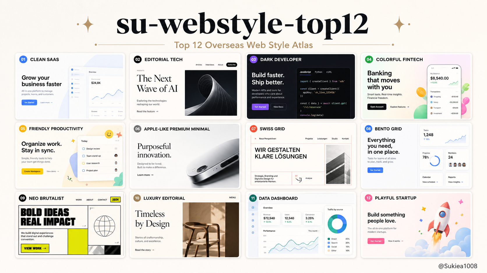

# su-webstyle-top12

**中文** | [English](#english)

海外网页风格 Top 12 Skill（v0.2）：可执行 recipe + 选型路由 + 实现验收。  
适用于 Codex、Claude Code 和其他 Agent。

**[在线体验 12 种风格 →](https://doublesq97-ui.github.io/su-webstyle-top12/)**

它抬高**最低标准**（色/字/圆角/边框/阴影、构图、Evidence），但不锁死上限——强模型可以叠加发挥。



## 它能做什么

- Browse / Choose / Recommend / **Auto** / Apply 五模式
- 12 种风格的**可执行 recipe**（tokens + 构图 + 反模式 + 验收证据）
- 交付物分流：正经网页 / Artifact 模板 / 用户全局排版（只套皮肤）
- Artifact：列表、仪表盘、粘轨阅读架、笔记条等
- 有 `su-motion-top12` 时，建站默认可配对动效

## 默认怎么用

| 场景 | 模式 |
|---|---|
| 看看有哪些风格 | Browse / Choose |
| 帮我推荐 2–3 个 | Recommend |
| 你决定 / 做专业落地页 | **Auto → Apply** |
| 指定 06 / 侘寂米色… | Apply |
| 全局已有惯用排版 | 结构跟用户，只套皮肤并说明 |

## Top 12

| # | 风格 | 适合场景 |
|---|---|---|
| 01 | Modern SaaS Clean | SaaS、AI、B2B（中性纸白 + 单 accent） |
| 02 | Editorial Tech | 实验室、研究、内容品牌 |
| 03 | Linear / Vercel Dark | API、基础设施、开发者工具 |
| 04 | Stripe-ish Business | 金融科技、平台 |
| 05 | Notion / Figma Friendly | 协作、教育、创作者 |
| 06 | Apple Premium Minimal | 旗舰产品、硬件 |
| 07 | Restrained Swiss / 克制瑞士风 | 设计机构、作品集、结构型产品页 |
| 08 | Fingerprint Signal / 橙信号控制台 | AI/API 分析产品页（暖底 + 单橙信号） |
| 09 | Neo Brutalism | 活动、年轻品牌 |
| 10 | **Wabi Beige / 侘寂米色** | 生活方式、安静品牌 |
| 11 | **Corporate Blue / 蓝色商务** | B2B 可信营销（不是后台壳） |
| 12 | Playful Startup | 教育、社区、消费 |

后台/密读 UI 用模板：`dashboard-ops`、`sticky-rail`、`list-rows`，再套任意风格皮肤。

## 安装

```bash
cp -R su-webstyle-top12 ~/.claude/skills/
# 或 ~/.codex/skills/
```

```text
/su-webstyle-top12 帮我做一个专业产品首页，你决定风格
```

```text
用 dashboard-ops + Corporate Blue 皮肤做运营数据页
```

## 项目结构

```text
su-webstyle-top12/
├── SKILL.md
├── references/
│   ├── style-catalog.json
│   ├── selection-guide.md
│   ├── deliverable-guide.md
│   ├── artifact-templates.md
│   ├── implementation-contract.md
│   ├── style-atlas.md
│   ├── usage-modes.md
│   ├── output-patterns.md
│   └── recipes/          # 12 份可执行规格
├── assets/
│   ├── style-board-template.html
│   ├── samples/
│   └── promo-*.png
├── examples/prompts.md
└── adapters/cursor-rule.md
```

## License

MIT · Creator mark `@Sukiea1008` 仅用于本仓库宣传图，不写入普通用户产出。

---

<a id="english"></a>

# su-webstyle-top12

[中文](#su-webstyle-top12) | **English**

Top 12 overseas web styles with executable recipes (v0.2): select, auto-route, apply, and verify.

## Modes

Browse · Choose · Recommend · **Auto** · Apply

**[Live Core 12 demo →](https://doublesq97-ui.github.io/su-webstyle-top12/)**

## Deliverable paths

- **website** — full recipe (signatures, sections, evidence)
- **artifact** — template + density + skin
- **user-layout** — keep user structure; skin only + disclose

## Catalog highlights

- 01 cleaned neutral SaaS tokens  
- 10 **Wabi Beige** (replaces Luxury Editorial)  
- 11 **Corporate Blue** (replaces Data Dashboard-as-style; ops UI is a template)

## Install

```bash
cp -R su-webstyle-top12 ~/.claude/skills/
```

## License

MIT
